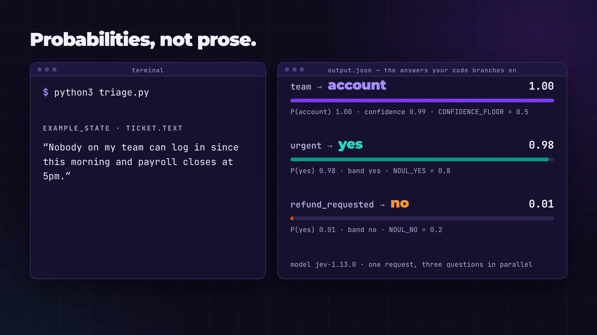

<div align="center">

# ⚡ prompt2jev

**Turn natural language into Jev: an LLM prompt or a plain requirement in, typed questions and runnable code out.**

[](#install) [](#catalog) [](https://github.com/sumleo/prompt2jev/actions/workflows/test.yml) [](LICENSE)

English · [简体中文](README.zh.md)

[Overview](#overview) · [Contents](#contents) · [Install](#install)

[](video/prompt2jev-walkthrough.mp4)

*23 seconds, no narration: [the end-to-end example](#example) from prompt to real answers. Click the poster to play; the source is in [`video/`](video/README.md).*

</div>

<a id="overview"></a>
## Overview

prompt2jev turns natural language into a Jev request and the code around it.

**In:** an LLM prompt you already run (a system prompt, a prompt template, or a
prompt-and-parse step that returns labels, scores, booleans, or JSON fields), or a
requirement stated in plain words with no prompt written yet.

**Out:** the same decision rebuilt on [TypeSafe Jev](https://docs.typesafe.ai). Jev is
TypeSafe's System One model. It does not generate text. It answers typed questions about
a `state` (`choice` picks a label, `score` grades on a scale, `noul` answers yes or no)
and returns probabilities your code can branch on. Jev judges; your code decides.

```
natural language in                     what you get out
──────────────────────────────          ─────────────────────────────────────────────
a system prompt                         request.json   state + typed Jev questions
a prompt template               ──►     decide.py      a script that sends it and branches
a plain-language requirement            assumptions    what to confirm before you automate
```

The skill teaches a coding agent to do the conversion; a bundled CLI checks and
generates the pieces:

- **Convert:** each judgment in the prompt becomes one atomic `choice` / `score` / `noul`
  question; every rule code can compute (arithmetic, dates, exact matching) moves into a
  constants block and code; formatting instructions are dropped.
- **Verify:** the dependency-free CLI validates the request against the API contract and
  lints it against the TypeSafe docs' best practices before you see it.
- **Generate:** the same CLI writes a runnable program from the validated request:
  Python with the official SDK, JavaScript with the official SDK, dependency-free
  Python, or the raw `curl` request for any other language.
- **Adapt:** five archetype requests cover routing, guardrails, rubrics, extraction,
  and claim checks; copy one and edit.

**New here?** [Give the install prompt to your agent](#install), then
[paste one of the usage prompts](#usage). You do not need to write JSON yourself.
[See a prompt go all the way to a running script and real answers](#example).

<a id="contents"></a>
## Table of contents

| Get started | Explore | Go deeper |
|---|---|---|
| [📦 Install](#install) | [🧪 End to end: prompt in, script and answers out](#example) | [🧯 Pitfalls the skill guards against](#pitfalls) |
| [🚀 How to use](#usage) | [🗂 Pick an archetype](#catalog) | [⚡ Two habits that make Jev useful](#habits) |
| [⌨️ Command line](#cli) | [📐 The conversion package](#package) | [🔗 Sources & credits](#credits) |

Works with Claude Code, Codex, OpenCode, Cursor, Gemini CLI, and any agent that reads
`SKILL.md` files.

<a id="install"></a>
## 📦 Install: give this to your agent

Paste this into **Claude Code, Codex, OpenCode, Cursor, or Gemini CLI**:

```text
Install the prompt2jev skill from
https://raw.githubusercontent.com/sumleo/prompt2jev/main/docs/install.md
into this project. Check my environment, install project-local, verify offline
with a dry run, and do not make a paid call.
```

Your agent copies the self-contained `skills/prompt2jev/` folder into the right place,
runs an offline dry run, and reports what still needs you (usually just an API key).
[Agent installation guide](docs/install.md)

<details>
<summary>Prefer to install it yourself?</summary>

**Claude Code plugin**

```bash
claude plugin marketplace add sumleo/prompt2jev
claude plugin install prompt2jev@prompt2jev
```

Invoke with `/prompt2jev:prompt2jev` or by asking to "use the prompt2jev skill".

**Other agents via skills.sh**

```bash
npx skills add sumleo/prompt2jev --skill prompt2jev
```

Pick your agent when prompted. Add `-g` for a user-wide install.

**Manual copy** of the whole `skills/prompt2jev/` folder:

| Agent | Project-local destination |
|---|---|
| Claude Code | `.claude/skills/prompt2jev/` |
| Codex | `.agents/skills/prompt2jev/` |
| OpenCode | `.opencode/skills/prompt2jev/` |
| Cursor | `.cursor/skills/prompt2jev/` |
| Gemini CLI | `.gemini/skills/prompt2jev/` |

**Optional command on PATH** (the script itself needs only Python 3.10+):

```bash
uv tool install git+https://github.com/sumleo/prompt2jev
# or: pipx install git+https://github.com/sumleo/prompt2jev
```

</details>

<a id="usage"></a>
## 🚀 Installed it? Here is how to use it

**Send one of these prompts to your agent.** Name the skill and point at the prompt
or the requirement; the agent does the digging.

### Convert a prompt that lives in your code

```text
Use the prompt2jev skill to convert the system prompt in src/triage.py into a Jev
decision. Keep the same downstream behavior. Validate the request before showing
it and do not make a live call yet.
```

### Convert a prompt you paste in

Replace the quoted text with your own:

```text
Use the prompt2jev skill to convert this LLM prompt into a Jev decision:
"Classify the support ticket into billing, shipping, or account. Set urgent=true
if the customer cannot use the product or has a deadline today. If they ask for a
refund, add refund=true. Output JSON only."
```

### Start from a requirement instead of a prompt

```text
Use the prompt2jev skill. I need to route incoming emails to sales, support, or
spam, and flag anything that mentions a contract renewal. Design the Jev decision
and the code that consumes it.
```

### Get a script you can run

```text
Use the prompt2jev skill to turn the ticket prompt above into a Python script I can
run on a ticket. Validate the request, generate the script, compile it, and if my
TYPESAFE_API_KEY is set, run it once on the example and show me the real output.
```

Say "TypeScript" or "Go" instead of "Python" and the skill switches to the official
JavaScript SDK or to a plain HTTP request; see [the end-to-end example](#example).

The agent first collects context (placeholders, the parser, the code that branches on
each output field, existing enums), asks only about gaps that change a question's
shape, and states the rest as assumptions.

<a id="package"></a>
### 📐 What you get back

Every conversion is a five-part package, in this order:

1. **Decision contract**: the decision, evidence unit, consumer of each answer, unknown path, success check.
2. **Split table**: every prompt instruction mapped to `choice`, `noul`, `score`, `code`, `keep-llm`, or `drop`.
3. **Request JSON** in the native `{model, state, questions}` shape, validated with `prompt2jev validate --strict` first.
4. **Composition code as a file that runs**: generated from the validated request with `prompt2jev code`, in your project's language, with all thresholds and weights in one constants block and the branching filled in.
5. **Assumptions and fixtures** to confirm and test before anything is automated.

For the ticket prompt above: the category becomes a Choice with an `other` fallback,
"urgent" and "refund" become Nouls with the prompt's own definitions moved into
`criteria`, the deadline check stays with the model but the JSON formatting rule is
dropped. The [playbook](skills/prompt2jev/references/playbook.md) walks through a full
example including the arithmetic and date rules that move into code.

<a id="catalog"></a>
### 🗂 Pick an archetype

| Your prompt does this… | Start from | What it shows |
|---|---|---|
| Classifies into a fixed set and flags a few things | `classify-route` | Intent Choice with fallback, speculative Nouls, a Score read on every branch |
| Screens messages against a list of rules | `checklist-guardrail` | One Noul per hazard plus a severity Score; precedence in code |
| Grades on a rubric or a 1 to 10 scale | `rubric-composite` | One Score per dimension, weights in code, a hard-rule Noul |
| Extracts values from text | `extract-select` | Candidates found by regex, a Choice over them with `not_stated` |
| Checks a claim against a source | `verify-claim` | Support Choice plus contextual Nouls; verbatim matching stays in code |

`prompt2jev template <name>` prints any of them; the files live in
[`skills/prompt2jev/assets/`](skills/prompt2jev/assets/). Each is a validated
request to copy, not a recorded model result.

<a id="cli"></a>
### ⌨️ Prefer the command line? (Optional)

The agent runs these for you; you can also run them yourself.

```bash
prompt2jev setup                                   # which keys are present; prints no values
prompt2jev template classify-route > request.json  # start from an archetype
prompt2jev validate request.json --strict          # contract check + best-practice lint
prompt2jev code request.json --lang python --output decide.py   # runnable program (see below)
prompt2jev run request.json --dry-run              # print exactly what would be sent
prompt2jev run request.json                        # live call to TypeSafe (TYPESAFE_API_KEY)
prompt2jev run request.json --provider openrouter  # or through OpenRouter (OPENROUTER_API_KEY)
```

`code` accepts `--lang python` (official `typesafe-sdk`), `javascript` (official
`@typesafe-ai/sdk`, Node 20+), `python-stdlib` (no dependencies), or `curl` (the raw
HTTP request any language can copy). It checks the request against the API contract
and prints the lint findings first, so a request that breaks the contract never becomes
code; run `validate --strict` before it to stop on lint warnings too. JavaScript output
is an ES module, so name it `.mjs`.

Without the command installed, replace `prompt2jev` with
`python3 skills/prompt2jev/scripts/prompt2jev.py`.

Exit codes: `0` success; `1` invalid request, lint failure under `--strict`, missing key,
or provider error. `run` prints the request, the raw response, and a per-question report
whose confidence bands are illustrative defaults for you to tune. A response that does
not match the documented contract is still printed in full before the error, so a paid
call is never lost. `--allow CODE` suppresses a lint code you have judged a false
positive for one request.

**Keys.** `TYPESAFE_API_KEY` from https://console.typesafe.ai/keys for the official API
(model `jev-latest`), or `OPENROUTER_API_KEY` from https://openrouter.ai/settings/keys
(model `typesafe/jev-1.13`). Set it in the environment that launches the agent or the
CLI; never paste it into chat, a request file, or a repository. Validation and dry runs
need no key. A live call costs money and sends the state to the provider.

<a id="example"></a>
## 🧪 End to end: prompt in, script and real answers out

The ticket prompt from [How to use](#usage), taken all the way. Every file below lives
in [`examples/triage/`](examples/triage/) and was produced by the commands shown; the
answers are a real response from the TypeSafe API recorded on 2026-09-21 (model
`jev-1.13.0`). Rerun it and the probabilities may shift in the second decimal.

**1. What you say to the agent**

```text
Use the prompt2jev skill to turn this prompt into a Python script I can run:
"Classify the support ticket into billing, shipping, or account. Set urgent=true
if the customer cannot use the product or has a deadline today. If they ask for a
refund, add refund=true. Output JSON only."
```

**2. The request the skill writes** ([`examples/triage/request.json`](examples/triage/request.json))

The category becomes a Choice with an `other` fallback; "urgent" becomes a Noul with
the prompt's own definition moved into `criteria`; "refund" becomes a second Noul;
"Output JSON only" is dropped because the answers are already typed. It passes
`prompt2jev validate --strict`.

```json
{
  "model": "jev-latest",
  "state": {
    "ticket": {
      "text": "Nobody on my team can log in since this morning and payroll closes at 5pm."
    }
  },
  "questions": {
    "team": {
      "type": "choice",
      "instructions": "Which team should handle `ticket.text`?",
      "criteria": {
        "billing": "Charges, invoices, refunds, or subscriptions.",
        "shipping": "Delivery status, delays, lost or damaged packages.",
        "account": "Login, password, profile, permissions, or security.",
        "other": "None of the listed teams fits, or the message is not a support request."
      }
    },
    "urgent": {
      "type": "noul",
      "instructions": "Does `ticket.text` say the customer cannot use the product or has a deadline today?",
      "criteria": {
        "true": "States that the product is unusable for them now, or names a same-day deadline.",
        "false": "Describes a problem they can work around, or sets no deadline."
      }
    },
    "refund_requested": {
      "type": "noul",
      "instructions": "Does the customer in `ticket.text` explicitly ask for money back or a credit?"
    }
  }
}
```

**3. The script the skill generates** ([`examples/triage/triage.py`](examples/triage/triage.py))

```bash
prompt2jev validate examples/triage/request.json --strict
prompt2jev code examples/triage/request.json --lang python --output examples/triage/triage.py
```

<details>
<summary>triage.py, exactly as generated</summary>

```python
#!/usr/bin/env python3
"""Jev decision generated by prompt2jev from request.json.

One System One request sends every question at once; the code below reads the typed
answers. Every threshold lives in the constants block. The defaults are illustrative:
tune them on labeled data before an answer triggers an action.

Run:
    pip install typesafe-sdk      # the official SDK
    export TYPESAFE_API_KEY=...   # https://console.typesafe.ai/keys
    python3 triage.py             # judges EXAMPLE_STATE
    python3 triage.py state.json  # judges the JSON object in that file; - reads stdin
"""

from __future__ import annotations

import json
import sys

from typesafe_sdk import Choice, Noul, NoulCriteria, TypeSafeClient

MODEL = "jev-latest"  # pin a versioned id such as jev-1.13.0 once thresholds are tuned

# ----- Constants: every threshold in one place -----
CONFIDENCE_FLOOR = 0.5  # a Choice or Score below this is not acted on; a person decides
NOUL_YES = 0.8  # a Noul at or above this counts as yes
NOUL_NO = 0.2  # a Noul at or below this counts as no; in between is uncertain

QUESTIONS = {
    "team": Choice(
        instructions="Which team should handle `ticket.text`?",
        criteria={
            "billing": "Charges, invoices, refunds, or subscriptions.",
            "shipping": "Delivery status, delays, lost or damaged packages.",
            "account": "Login, password, profile, permissions, or security.",
            "other": "None of the listed teams fits, or the message is not a support request.",
        },
    ),
    "urgent": Noul(
        instructions="Does `ticket.text` say the customer cannot use the product or has a deadline today?",
        criteria=NoulCriteria(
            true="States that the product is unusable for them now, or names a same-day deadline.",
            false="Describes a problem they can work around, or sets no deadline.",
        ),
    ),
    "refund_requested": Noul(
        instructions="Does the customer in `ticket.text` explicitly ask for money back or a credit?",
    ),
}

# The state the request was written against. Build the real one from your own data.
EXAMPLE_STATE = {
    "ticket": {
        "text": "Nobody on my team can log in since this morning and payroll closes at 5pm.",
    },
}


def ask(state):
    """Send every question in one request; they run in parallel."""
    with TypeSafeClient() as client:  # reads TYPESAFE_API_KEY; retries 429 and 529 itself
        return client.system_one(state=state, questions=QUESTIONS, model=MODEL)


def read_choice(answer) -> dict:
    """The chosen option, or needs_review when the distribution is too flat to act on."""
    acted = answer.confidence >= CONFIDENCE_FLOOR
    return {"choice": answer.choice if acted else "needs_review", "confidence": answer.confidence,
            "probabilities": answer.probabilities}


def read_score(answer) -> dict:
    """The probability-weighted level and the nearest level's description."""
    level = int(answer.score + 0.5)
    return {"score": answer.score, "level": level, "label": answer.legend[level], "confidence": answer.confidence}


def read_noul(answer) -> dict:
    """P(yes) with a yes / uncertain / no band. A Noul has no separate confidence."""
    value = answer.noul
    band = "yes" if value >= NOUL_YES else "no" if value <= NOUL_NO else "uncertain"
    return {"noul": value, "band": band}


def decide(state) -> dict:
    """Read every answer, then branch. Replace the return with the decision your code needs."""
    response = ask(state)
    answers = response.answers
    team = read_choice(answers["team"])
    urgent = read_noul(answers["urgent"])
    refund_requested = read_noul(answers["refund_requested"])
    # Branch on the values above here; keep every threshold as a constant at the top.
    return {
        "model": response.model,
        "team": team,
        "urgent": urgent,
        "refund_requested": refund_requested,
    }


def main(argv: list[str]) -> int:
    if len(argv) > 1:
        with (sys.stdin if argv[1] == "-" else open(argv[1], encoding="utf-8")) as handle:
            state = json.load(handle)
    else:
        state = EXAMPLE_STATE
    print(json.dumps(decide(state), ensure_ascii=False, indent=2))
    return 0


if __name__ == "__main__":
    sys.exit(main(sys.argv))
```

</details>

**4. Run it**

```bash
pip install typesafe-sdk
export TYPESAFE_API_KEY=...                        # https://console.typesafe.ai/keys
python3 examples/triage/triage.py                  # judges the ticket in EXAMPLE_STATE
python3 examples/triage/triage.py my-ticket.json   # judges {"ticket": {"text": "..."}} from a file
```

**5. What comes back** ([`examples/triage/output.json`](examples/triage/output.json))

```json
{
  "model": "jev-1.13.0",
  "team": {
    "choice": "account",
    "confidence": 0.99,
    "probabilities": {
      "billing": 0.0,
      "shipping": 0.0,
      "account": 1.0,
      "other": 0.0
    }
  },
  "urgent": {
    "noul": 0.98,
    "band": "yes"
  },
  "refund_requested": {
    "noul": 0.01,
    "band": "no"
  }
}
```

Read it as: the ticket goes to `account` (probability 1.0, confidence 0.99), it is
urgent (P(yes) 0.98, band `yes`), and nobody asked for a refund (P(yes) 0.01, band
`no`). The same script on "I was charged twice for order 5521. Please refund the
duplicate charge." answered `billing`, urgent `no`, refund `yes`. The agent's last
step replaces the `return` in `decide()` with your routing, for example sending
`needs_review` (confidence under `CONFIDENCE_FLOOR`) and `other` to a person; the
[composition reference](skills/prompt2jev/references/composition.md) shows that edit.

Prefer another language? `--lang javascript` writes the same program on the official
Node SDK, `--lang python-stdlib` needs no packages, and `--lang curl` prints the raw
request for Go, Rust, Java, or anything else. All four were run against the live API
while writing this section.

<a id="habits"></a>
## ⚡ Two habits that make Jev useful

- **Split the prompt, then ask everything at once.** One judgment per question, every
  independent question in the same request, speculative ones included. Questions run in
  parallel and cannot see each other's answers; a second request is only for state that
  depends on a first answer.
- **Keep the rules in code.** Arithmetic, dates, counting, thresholds, and exact matching
  never go to the model. Extraction becomes selection over candidates code found.
  Thresholds live in one constants block and scale with the cost of a wrong action.

<a id="pitfalls"></a>
## 🧯 Pitfalls the skill guards against

Each row is a rule from the TypeSafe docs, the failure it prevents, and how this repo
enforces it.

| Rule | Failure it prevents | Enforced by |
|---|---|---|
| Full list of options plus a fallback such as `other` | The model is forced to pick a wrong label | lint `choice-no-fallback` |
| Score levels describe situations, 2 to 10 of them | Bare numbers give the model nothing to match | lint `score-numeric-levels`, `score-degree-only` |
| One proposition per Noul, high value means yes | Compound or inverted questions read backwards in code | lint `noul-compound`, `noul-negated` |
| Numbers, dates, and counts stay in code | Jev is not a calculator | lint `math-in-question`, playbook split table |
| Full question in `instructions`; ids are not sent | The id was doing the work | lint `instructions-too-short` |
| State holds only what the questions use, referenced by backticked path | Unrelated detail lowers accuracy | lint `state-field-unreferenced`, `state-too-large` |
| Pin a versioned model once thresholds are tuned | `jev-latest` moves between releases | lint `model-alias` (info) |
| Confidence bands scaled by risk; Noul thresholds are separate | One number used for every action | SKILL.md Step 5, `references/composition.md` |
| Composition code is a file that compiled and ran | A fragment or pseudo-code the reader must finish | `prompt2jev code`, SKILL.md part 4 |

Every lint rule is a heuristic with a documented `--allow` escape hatch. The full rule
set with sources is in [question-design.md](skills/prompt2jev/references/question-design.md).

<a id="layout"></a>
## 🧭 Where things live

```
skills/prompt2jev/
  SKILL.md              the skill (what to deliver, six steps, red flags)
  references/           playbook, question design, API contract, composition, examples
  assets/               five validated archetype requests
  scripts/prompt2jev.py validator, linter, code generator, runner (Python standard library only)
examples/triage/        the end-to-end example above: request, generated script, real output
docs/                   TypeSafe docs mirror the references were written from
docs/install.md         the agent-driven install guide
video/                  the README video: rendered prompt2jev-walkthrough.mp4 and poster, plan, and the Hyperframes source
tests/                  unittest suite: python3 -m unittest discover -s tests -v
```

<a id="credits"></a>
## 🔗 Sources & credits

- [TypeSafe docs](https://docs.typesafe.ai): the API contract, primitives, confidence,
  patterns, and the jev-1.13 jaggedness page the rules come from. A mirror is in `docs/`.
- [typesafe-ai/skills](https://github.com/typesafe-ai/skills): the official TypeSafe agent
  skill; use it alongside this one when building a new integration from scratch.
- [wuyoscar/jev-skill](https://github.com/wuyoscar/jev-skill): the collection whose repo
  layout, install flow, and README shape this project follows.

[MIT](LICENSE).
